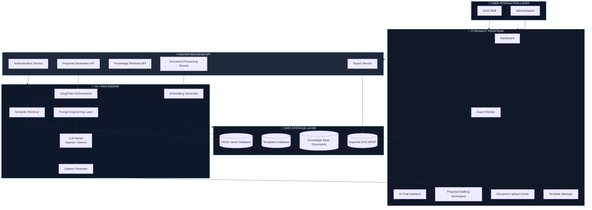
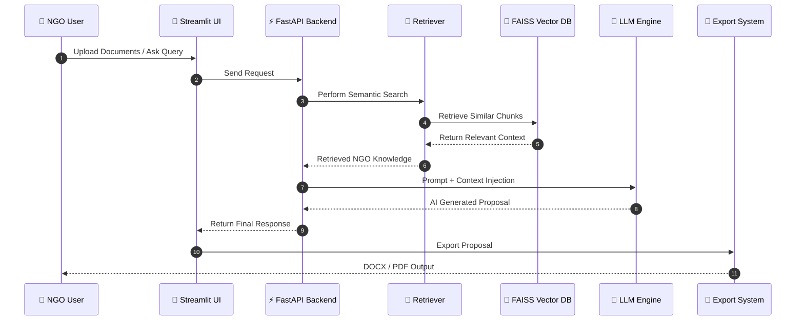
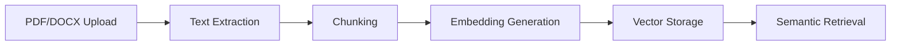

<div align="center">


</div>

# 🌍 NGO Proposal Drafting Bot

<div align="center">


<h3>
🚀 GenAI-Powered Proposal Intelligence Platform for NGOs & Grant Organizations
</h3>

<p>
An enterprise-grade Retrieval-Augmented Generation (RAG) system that automates NGO proposal drafting, knowledge retrieval, donor documentation, and AI-assisted grant writing.
</p>

</div>

---

# ✨ Overview

The <b>NGO Proposal Drafting Bot</b> is a modern AI-powered platform designed to help NGOs, non-profits, social enterprises, and CSR teams streamline the process of creating professional grant proposals.

The platform leverages:

* 🧠 Large Language Models (LLMs)
* 📚 Retrieval-Augmented Generation (RAG)
* 🔎 Semantic Search
* 📄 Intelligent Document Processing
* ⚡ FastAPI Microservices
* 🎨 Streamlit Interactive Frontend

The system transforms scattered organizational documents into a centralized AI knowledge assistant capable of generating:

✅ Grant Proposals
✅ Impact Reports
✅ Funding Applications
✅ Donor Documentation
✅ Program Summaries
✅ Citation-backed Responses

---

# 🎯 Problem Statement

NGOs often struggle with:

* Repetitive proposal writing
* Searching historical project documents
* Maintaining donor-specific formatting
* Reusing institutional knowledge
* Tight funding deadlines
* Inconsistent writing quality
* Lack of centralized knowledge management

This project solves these challenges by creating an intelligent AI proposal drafting ecosystem.

---

# 🧠 Core Features

<table>
<tr>
<td width="50%">

## 🤖 AI Proposal Drafting

Generate professional proposal sections using organizational knowledge.

* Executive Summary
* Objectives
* Methodology
* Budget Justification
* Sustainability Plans
* Monitoring & Evaluation

</td>
<td width="50%">

## 📚 Knowledge Base Q&A

Chat with uploaded NGO documents.

* Semantic Retrieval
* Citation Generation
* Context-Aware Answers
* Multi-document Search

</td>
</tr>

<tr>
<td width="50%">

## 📂 Document Management

Upload and process:

* PDF
* DOCX
* TXT
* Past Proposals
* Impact Reports
* Donor Guidelines

</td>
<td width="50%">

## 🧩 Template Management

Create reusable proposal templates.

* Donor-specific structures
* Custom sections
* Dynamic outlines
* Standardized formats

</td>
</tr>

<tr>
<td width="50%">

## 📄 Export System

Export completed proposals.

* DOCX Export
* PDF Export
* Citation Preservation
* Professional Formatting

</td>
<td width="50%">

## 🔐 Role-Based Access

Secure multi-role architecture.

* Admin Dashboard
* User Workspace
* Document Permissions
* Prompt Management

</td>
</tr>
</table>

---

# 🏗️ System Architecture

<div align="center">



</div>

---

# 🔄 RAG Workflow

## Retrieval-Augmented Generation Pipeline

<div align="center">



</div>

---

# 🧠 Proposal Generation Flow

<div align="center">


</div>

---

# 🖥️ Tech Stack

<div align="center">

| Category         | Technologies                              |
| ---------------- | ----------------------------------------- |
| Frontend         | Streamlit                                 |
| Backend          | FastAPI                                   |
| AI Framework     | LangChain                                 |
| Vector Database  | FAISS / ChromaDB                          |
| LLM Providers    | OpenAI / Gemini                           |
| Embeddings       | OpenAI Embeddings / Sentence Transformers |
| Document Parsing | PyPDF, python-docx                        |
| Validation       | Pydantic                                  |
| Testing          | Pytest + Hypothesis                       |
| Exporting        | DOCX + PDF Generators                     |

</div>

---

# 📁 Project Structure

```bash
NGO-Proposal-Drafting-Bot/
│
├── app/
│   ├── api/                  # FastAPI routes
│   ├── services/             # Core business logic
│   ├── models/               # Pydantic schemas
│   ├── utils/                # Utility functions
│   └── main.py               # FastAPI entry point
│
├── frontend/
│   ├── pages/                # Streamlit pages
│   ├── components/           # UI components
│   └── app.py                # Streamlit entry point
│
├── data/
│   ├── documents/            # Uploaded files
│   ├── vectorstore/          # FAISS index
│   ├── templates/            # Proposal templates
│   └── exports/              # Generated outputs
│
├── tests/
│   ├── unit/
│   ├── integration/
│   └── property/
│
├── scripts/
│   ├── seed_data.py
│   └── create_admin.py
│
├── requirements.txt
├── pyproject.toml
└── README.md
```

---

# ⚙️ Installation

## 1️⃣ Clone Repository

```bash
git clone https://github.com/yourusername/ngo-proposal-drafting-bot.git

cd ngo-proposal-drafting-bot
```

---

## 2️⃣ Create Virtual Environment

```bash
python -m venv venv
```

### Windows

```bash
venv\Scripts\activate
```

### Linux / macOS

```bash
source venv/bin/activate
```

---

## 3️⃣ Install Dependencies

```bash
pip install -r requirements.txt
```

---

## 4️⃣ Configure Environment Variables

Create a `.env` file.

```env
OPENAI_API_KEY=your_api_key
GOOGLE_API_KEY=your_gemini_key
VECTOR_DB=faiss
```

---

# ▶️ Running the Project

## Run Backend

```bash
uvicorn app.main:app --reload
```

Backend API:

```bash
http://localhost:8000
```

Swagger Docs:

```bash
http://localhost:8000/docs
```

---

## Run Frontend

```bash
streamlit run frontend/app.py
```

Frontend:

```bash
http://localhost:8501
```

---

# 📚 Document Processing Pipeline



---

# 🧩 AI Components

## 🔎 Semantic Search

The system uses vector embeddings to retrieve semantically similar information.

Example:

```text
"women empowerment outcomes"
```

Can retrieve:

```text
"female community development impact metrics"
```

Even without exact keyword matches.

---

## 🧠 Prompt Engineering

The platform dynamically builds prompts using:

* User instructions
* Retrieved NGO context
* Proposal templates
* Donor formatting standards

---

## 📌 Citation Generation

Every generated response can include source references.

Example:

```text
(Source: education_impact_report.pdf, Page 12)
```

---

# 🎨 Frontend UI Design

The frontend is designed for:

✅ Simplicity
✅ Accessibility
✅ Fast Navigation
✅ Multi-page Workflow
✅ Interactive AI Chat Experience

## Major UI Sections

| Page              | Description                |
| ----------------- | -------------------------- |
| Dashboard         | Central workspace          |
| AI Chat           | Knowledge Base Q&A         |
| Proposal Drafting | Generate proposal sections |
| Templates         | Manage proposal structures |
| Admin Panel       | Upload documents & prompts |
| Export Center     | Download DOCX/PDF          |

---

# 🔐 Authentication & Security

The application supports role-based access control.

## User Roles

| Role  | Permissions                |
| ----- | -------------------------- |
| User  | Draft proposals & chat     |
| Admin | Manage templates/documents |

---

# 🧪 Testing Strategy

The project includes:

* ✅ Unit Testing
* ✅ Integration Testing
* ✅ Property-Based Testing

## Run Tests

```bash
pytest
```

---

# 🚀 Deployment Ready

The architecture supports deployment on:

* Docker
* Render
* Railway
* AWS
* Azure
* GCP
* Kubernetes

---

# 📈 Future Enhancements

## Planned Features

* 🌐 Multi-language proposal generation
* 👥 Collaborative editing
* 📊 NGO analytics dashboard
* 🧠 Fine-tuned NGO models
* ☁️ Cloud vector databases
* 🔔 Donor deadline reminders
* 📝 Real-time co-authoring
* 📱 Mobile-responsive UI

---

# 📸 Screenshots

```text
Add screenshots here:

assets/
├── dashboard.png
├── ai-chat.png
├── drafting-page.png
└── admin-panel.png
```

---

# 📊 Performance Advantages

| Traditional Workflow   | AI-Powered Workflow      |
| ---------------------- | ------------------------ |
| Weeks of drafting      | Minutes of drafting      |
| Manual document search | Semantic retrieval       |
| Repetitive writing     | Automated generation     |
| Scattered knowledge    | Centralized intelligence |

---

# 💡 Key Technical Highlights

## What Makes This Project Strong?

✔ Production-grade architecture
✔ End-to-end RAG implementation
✔ Real-world NGO use case
✔ Scalable modular design
✔ Semantic retrieval system
✔ AI-assisted proposal automation
✔ Full-stack integration
✔ Export-ready document generation
✔ Professional testing strategy

---

# 👨‍💻 Author

<div align="center">

## P R Matthew

🎓 AI & Software Engineering Enthusiast
🚀 Full Stack + Generative AI Developer
🌍 Building AI systems for social impact

</div>

---

# 🤝 Contributing

Contributions are welcome.

## Steps

1. Fork the repository
2. Create a new branch
3. Commit your changes
4. Push to your branch
5. Open a Pull Request

---

# 📜 License

This project is licensed under the MIT License.

---

# ⭐ Support

If you found this project useful:

🌟 Star the repository
🍴 Fork the project
📢 Share with the developer community

---

<div align="center">


<br><br>


</div>
